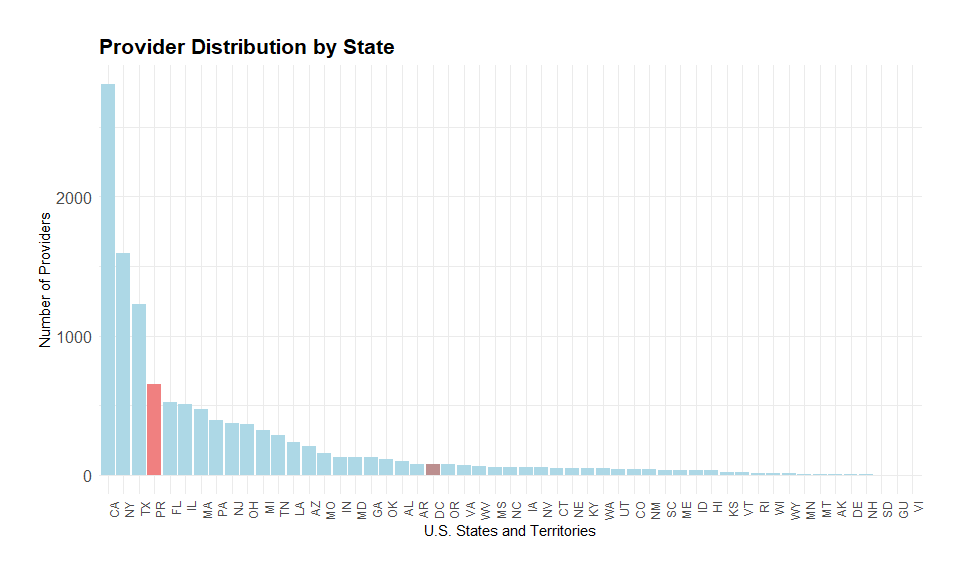
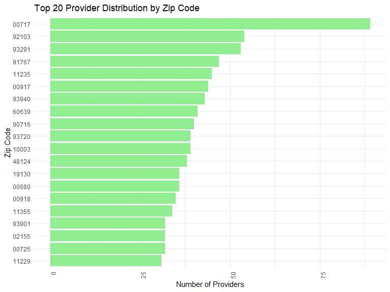

Geographic Disparities in Access to Telemedicine Services in the
Post-COVID-19 Era
================
Shirisha Biyyala
2024-12-09

<!-- ## Preliminary tasks -->

## 5. Exploratory Data Analysis

### 5.1 Provider distribution analysis

Analyze how telemedicine-capable providers are distributed across
geographic regions on sample data.

``` r
# Count the number of providers by state
provider_by_state <- data %>%
  group_by(state_cd) %>%
  summarise(provider_count = n())

# Count the number of providers by ZIP code
provider_by_zip <- data %>%
  group_by(zip_code) %>%
  summarise(provider_count = n())

# View the distribution
print(provider_by_state)
```

    ## # A tibble: 53 × 2
    ##    state_cd provider_count
    ##    <chr>             <int>
    ##  1 AK                    7
    ##  2 AL                   97
    ##  3 AR                   78
    ##  4 AZ                  208
    ##  5 CA                 2806
    ##  6 CO                   45
    ##  7 CT                   53
    ##  8 DC                   78
    ##  9 DE                    5
    ## 10 FL                  524
    ## # ℹ 43 more rows

``` r
print(provider_by_zip)
```

    ## # A tibble: 2,574 × 2
    ##    zip_code provider_count
    ##       <int>          <int>
    ##  1      603              3
    ##  2      612             15
    ##  3      617              1
    ##  4      622              3
    ##  5      623             12
    ##  6      627              1
    ##  7      641              3
    ##  8      646              2
    ##  9      652              1
    ## 10      656              2
    ## # ℹ 2,564 more rows

``` r
# State-wise distribution of providers
state_distribution <- data %>%
  group_by(state_cd) %>%
  summarise(provider_count = n()) %>%
  arrange(desc(provider_count))

# Define the categories for coloring
state_distribution$category <- ifelse(state_distribution$state_cd %in% c("GU", "PR", "VI"), "Special Notes",                                                                   ifelse(state_distribution$state_cd %in% c("AK", "AL", "AR", "AZ", "CA", "CO", "CT", "DE", "FL", "GA", "HI", "IA", "ID", "IL", "IN", "KS", "KY", "LA", "MA", "MD", "ME", "MI", "MN", "MO", "MS", "MT", "NC", "NE", "NH", "NJ", "NM", "NV", "NY", "OH", "OK", "OR", "PA", "RI", "SC", "SD", "TN", "TX", "UT", "VA", "VT", "WA", "WI", "WV", "WY"), "State", 
                               "U.S. Territories"))

# Map colors to categories
state_distribution$color <- ifelse(state_distribution$category == "State", "lightblue", 
                            ifelse(state_distribution$category == "U.S. Territories", "rosybrown", "lightcoral"))

# Plot the distribution of providers by state with colors on x-axis
ggplot(state_distribution, aes(x = reorder(state_cd, -provider_count), y = provider_count, fill = color)) +
  geom_bar(stat = "identity") +
  scale_fill_identity() +
  labs(
    title = "Provider Distribution by State",
    x = "U.S. States and Territories",
    y = "Number of Providers",
    fill = "Category"
  ) +
  theme_minimal() +
  theme(
    axis.text.x = element_text(angle = 90, hjust = 1),  
    axis.text.y = element_text(size = 12),  
    plot.title = element_text(size = 16, face = "bold"),
    plot.margin = margin(1, 1, 1, 1, "cm"),
    )
```

<!-- -->

``` r
# Zip code distribution of providers
zip_distribution <- data %>%
  group_by(zip_code) %>%
  summarise(provider_count = n()) %>%
  arrange(desc(provider_count))

# Plot the distribution of providers by zip code (limiting to top 20 for better readability)
ggplot(zip_distribution[1:20,], aes(x = reorder(zip_code, provider_count), y = provider_count)) +
  geom_bar(stat = "identity", fill = "lightgreen") +
  coord_flip() + # Flips the axes for better readability
  theme_minimal() +
  labs(
    title = "Top 20 Provider Distribution by Zip Code",
    x = "Zip Code",
    y = "Number of Providers"
  ) +
  theme(axis.text.x = element_text(angle = 90, hjust = 1))
```

<!-- -->

## Data Visualization

## Data Modeling

## Interpretation

## Conclusion
