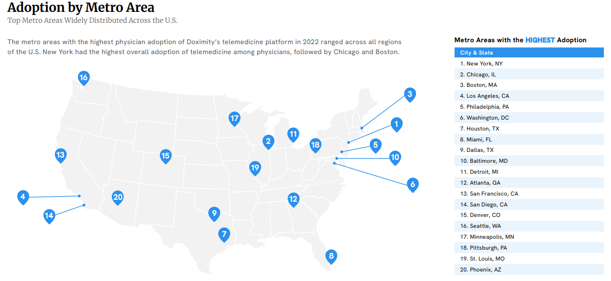
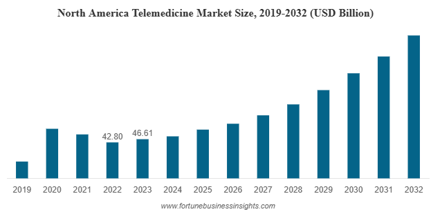
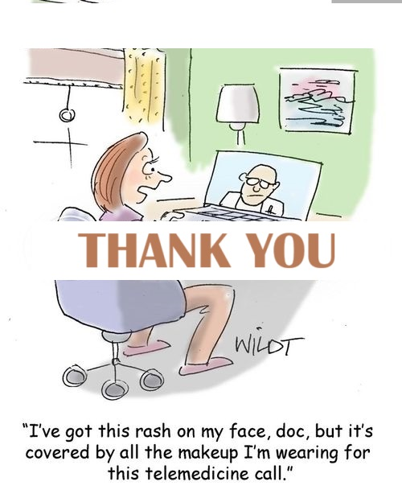

```{r setup, include=FALSE}
knitr::opts_chunk$set(echo = FALSE, message = FALSE, warning = FALSE)
```

```{r load-packages, include = FALSE}
library(tidyverse)
library(tidymodels)
library(knitr)
library(xaringanthemer)
library(sf)
library(tigris)
library(leaflet)
library(DT)
library(networkD3)
library(maps)
library(plotly)
```


```{r load-data, include=FALSE}
df = read.csv("../data/Medicare_Provider_Data.csv", colClasses = c(zip_code = "character"))
```

class: Left, middle

# WHY ?

```{r why-image, out.width="100%"}

```

---

class: Left, right

```{r why-images, out.width="60%", fig.align="center"}
# Displaying the first image

# Displaying the second image

```

---

## Datasets

#### Source: Provider Enrollment, Chain, and Ownership System (PECOS)

##### Centers for Medicare and Medicaid Services:

.pull-left[
<b style="color:brown; font-weight:bold;">Enrollment Data</b>

- healthcare practitioners enrolled in Medicare
- their identification, names, and provider types

<b style="color:brown; font-weight:bold;">Reassignment Data</b>

- reassignment of benefits for certain healthcare practitioners
- relationships with other providers
]

.pull-right[
<b style="color:brown; font-weight:bold;">Practice Location Data</b>

- locations where practitioners operate
- city, state, and ZIP code 

<b style="color:brown; font-weight:bold;">Secondary Specialty Data</b>

- additional specialties that practitioners may possess
- expanding the current services information 
]

---
class: Center, middle

<div style="display: flex; align-items: flex-start; height: 90vh;"> 
  <div style="flex: 1; font-size: 2.5em; font-weight: bold; text-align: center; display: flex; flex-direction: column; justify-content: center; padding-right: 20px; border-right: 3px solid black; height: 80%;"> 
    <div>Research</div>
    <div>Questions</div>
  </div>
   <div style="flex: 2; font-size: 1.25em; text-align: left; display: flex; flex-direction: column; justify-content: center; padding-left: 20px; height: 80%;">
    <ol>
      <li>How are telemedicine providers spread across different areas?</li>
      <li>Are there differences in telemedicine access based on location, demographics, or provider type?</li>
      <li>How do provider type and specialty affect telemedicine access?</li>
    </ol>
  </div>
</div>

---

## Provider distribution analysis - State-wise

```{r state-color}
# State-wise distribution of providers
state_distribution <- df %>%
  group_by(state_cd.before) %>%
  summarise(provider_count = n()) %>%
  arrange(desc(provider_count))

# Define the categories for coloring
state_distribution$category <- ifelse(state_distribution$state_cd.before %in% c("GU", "PR", "VI", "HI", "MP"), "Special Notes",                                                                   ifelse(state_distribution$state_cd.before %in% c("AK", "AL", "AR", "AZ", "CA", "CO", "CT", "DE", "FL", "GA", "IA", "ID", "IL", "IN", "KS", "KY", "LA", "MA", "MD", "ME", "MI", "MN", "MO", "MS", "MT", "NC", "NE", "NH", "NJ", "NM", "NV", "NY", "OH", "OK", "OR", "PA", "RI", "SC", "SD", "TN", "TX", "UT", "VA", "VT", "WA", "WI", "WV", "WY"), "State", 
                               "U.S. Territories"))

# Map colors to categories
state_distribution$color <- ifelse(state_distribution$category == "State", "lightblue", 
                            ifelse(state_distribution$category == "U.S. Territories", "rosybrown", "lightcoral"))
```

```{r state-provider, fig.width=12, fig.height=6, fig.align="center"}
# Plot the distribution of providers by state with colors on x-axis
ggplot(state_distribution, aes(x = reorder(state_cd.before, -provider_count), y = provider_count, fill = color)) +
  geom_bar(stat = "identity") +
  scale_fill_identity() +
  labs(
    title = "Provider Distribution by State",
    x = "U.S. States and Territories",
    y = "Number of Providers",
    fill = "Category"
  ) +
  theme_minimal() +
  theme(
    axis.text.x = element_text(angle = 90, hjust = 1),  
    axis.text.y = element_text(size = 12),  
    plot.title = element_text(size = 16, face = "bold"),
    plot.margin = margin(1, 1, 1, 1, "cm"),
    )
```

---

## Zip-code level provider distribution

```{r zip-code-provider, fig.width=12, fig.height=6, fig.align="center"}
# Ensure zip_code is treated as a character to preserve leading zeros
df$zip_code <- as.character(df$zip_code)

# Zip code distribution of providers
zip_distribution <- df %>%
  group_by(zip_code) %>%
  summarise(provider_count = n()) %>%
  arrange(desc(provider_count))

# Plot the distribution of providers by zip code (limiting to top 20 for better readability)
ggplot(zip_distribution[1:20,], aes(x = reorder(zip_code, provider_count), y = provider_count)) +
  geom_bar(stat = "identity", fill = "lightgreen") +
  coord_flip() + # Flips the axes for better readability
  theme_minimal() +
  labs(
    title = "Top 20 Provider Distribution by Zip Code",
    x = "Zip Code",
    y = "Number of Providers"
  ) +
  theme(axis.text.x = element_text(angle = 90, hjust = 1))
```

---

## Geographical distribution of providers distribution

```{r state-basic, include=FALSE}
# Step 1: Load US states shapefile using 'tigris'
us_states <- st_as_sf(states())

# Step 2: Transform the projection to WGS84 (for consistent mapping)
us_states <- st_transform(us_states, crs = 4326)

# Merge state shapefile with provider data
state_map_data <- us_states %>%
  left_join(state_distribution, by = c("STUSPS" = "state_cd.before"))

# Step 4: Filter for contiguous states (excluding Alaska, Hawaii, and other territories)
states_clean <- state_map_data %>%
  filter(!STUSPS %in% c("AK", "HI", "GU", "PR", "MP", "VI", "AS"))  # Exclude non-contiguous states and territories
```

```{r state-map, fig.width=10, fig.height=8, fig.align="center"}
# Step 5: Create a static map with Albers Equal Area projection, removing axis and grid
state_map <- ggplot(states_clean) +
  geom_sf(aes(fill = provider_count), color = "black", size = 0.1) +  # Color states based on provider count
  scale_fill_gradient(low = "lightblue", high = "darkblue", na.value = "gray") +  # Color scale
  coord_sf(crs = st_crs(5070)) +  # Reproject to Albers Equal Area
  labs(title = "Telemedicine Provider Distribution in the Contiguous US",
       fill = "Provider Count") +
  theme_minimal() +
  theme(
    legend.position = "bottom",
    axis.text = element_blank(),  # Remove axis text
    axis.ticks = element_blank(),  # Remove axis ticks
    axis.title = element_blank(),  # Remove axis titles
    panel.grid = element_blank()  # Remove gridlines
  )

state_map
```


---

## Reassignment by providers

```{r reassign-providers, fig.align="center"}
# Count the number of reassignments by each provider
reassignment_counts <- df %>%
  group_by(enrlmt_id, provider_type_desc.before, state_cd.before) %>%
  summarise(count = n()) %>%
  arrange(desc(count))

# Display the table interactively using DT
datatable(reassignment_counts, caption = "Number of Reassignments per Provider")
```

---

## Reassignment providers and receivers relationship

```{r sankey, fig.align="left"}
# Create a dataset showing unique pairs of reassigning and receiving providers
provider_relationships <- df %>%
  select(enrlmt_id, rcv_bnft_enrlmt_id, provider_type_desc.before, provider_type_desc.after) %>%
  distinct()

# Prepare data for Sankey diagram by counting reassignments
sankey_data <- provider_relationships %>%
  count(enrlmt_id, rcv_bnft_enrlmt_id) %>%
  rename(from = enrlmt_id, to = rcv_bnft_enrlmt_id, value = n)

# Select the top 20 relationships based on the count of reassignments (value)
top_sankey_data <- sankey_data %>%
  arrange(desc(value)) %>%
  head(20)

# Create Nodes data frame (unique provider IDs)
nodes <- data.frame(name = unique(c(top_sankey_data$from, top_sankey_data$to)))

# Create a mapping from provider IDs to node indices
top_sankey_data$from_id <- match(top_sankey_data$from, nodes$name) - 1
top_sankey_data$to_id <- match(top_sankey_data$to, nodes$name) - 1

# Create the Sankey diagram
sankey_plot <- sankeyNetwork(Links = top_sankey_data, 
                             Source = "from_id", 
                             Target = "to_id", 
                             Value = "value", 
                             NodeID = "name", 
                             units = "Reassignments", 
                             Nodes = nodes,
                             fontSize = 12,
                             nodeWidth = 30,
                             nodePadding = 10,
                             width = 800,
                             height = 600)

# Convert the Sankey diagram to a 'plotly' object for interactivity
library(plotly)
sankey_plotly <- plotly::plot_ly(
  type = "sankey",
  domain = list(x = c(0, 1), y = c(0, 1)),
  node = list(
    pad = 15,
    thickness = 20,
    line = list(color = "black", width = 0.5),
    label = nodes$name
  ),
  link = list(
    source = top_sankey_data$from_id,
    target = top_sankey_data$to_id,
    value = top_sankey_data$value
  )
)

# Display the Sankey diagram using plotly (interactive)
sankey_plotly
```

---

## Reassignment benefits received by providers

```{r receiving-reassignr, fig.align="center"}
# Count the number of receiving reassignments (after reassignment) by each provider
receiving_reassignment_counts <- df %>%
  group_by(rcv_bnft_enrlmt_id, provider_type_desc.after, state_cd.before) %>%
  summarise(count = n()) %>%
  arrange(desc(count))

# Display the table interactively using DT
datatable(receiving_reassignment_counts, caption = "Number of Receiving Reassignments per Provider")

```

---

## Limitations and Future Work

<div style="display: flex; justify-content: space-between; margin-top: 40px;">
  <!-- Box 1 -->
  <div style="width: 44%; padding: 15px; background-color: #f0f0f0; border-radius: 10px; box-shadow: 2px 2px 5px rgba(0, 0, 0, 0.1);">
    <h3 style="text-align: center; color: #333;">Sample Size</h3>
    <p>The sample dataset may not fully represent the entire population of telemedicine providers, limiting the ability to generalize results.</p>
  </div>

  <!-- Box 2 -->
  <div style="width: 44%; padding: 15px; background-color: #f0f0f0; border-radius: 10px; box-shadow: 2px 2px 5px rgba(0, 0, 0, 0.1); margin-top: 50px;">
    <h3 style="text-align: center; color: #333;">Data Accuracy</h3>
    <p>The datasets might contain errors or outdated information, which affects the reliability of findings.</p>
  </div>
</div>

<div style="display: flex; justify-content: space-between; margin-top: 40px; flex-direction: row-reverse;">
  <!-- Box 3 -->
  <div style="width: 44%; padding: 15px; background-color: #f0f0f0; border-radius: 10px; box-shadow: 2px 2px 5px rgba(0, 0, 0, 0.1);">
    <h3 style="text-align: center; color: #333;">Missing Key Factors</h3>
    <p>Important factors like urban vs. rural differences or patient demand and insurance coverage were not considered.</p>
  </div>

  <!-- Box 4 -->
  <div style="width: 44%; padding: 15px; background-color: #f0f0f0; border-radius: 10px; box-shadow: 2px 2px 5px rgba(0, 0, 0, 0.1); margin-top: 50px;">
    <h3 style="text-align: center; color: #333;">Geographical Limitations</h3>
    <p>The study used zip codes and cities, which may not accurately reflect the actual distribution of providers.</p>
  </div>
</div>

<div style="display: flex; justify-content: space-between; margin-top: 40px;">
  <!-- Box 5 --> padding: 15px; background-color: #f0f0f0; border-radius: 10px; box-shadow: 2px 2px 5px rgba(0, 0, 0, 0.1);">
    <h3 style="text-align: center; color: #333;">Lack of Time and Causal Analysis</h3>
    <p>The data doesn't account for changes over time or establish causal relationships, limiting the analysis.</p>
  </div>
</div>

---

```{r end-image, fig.width=8, fig.height=34, fig.align="center"}

```


